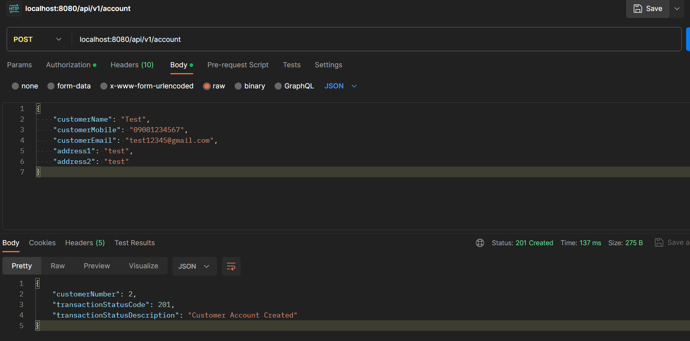
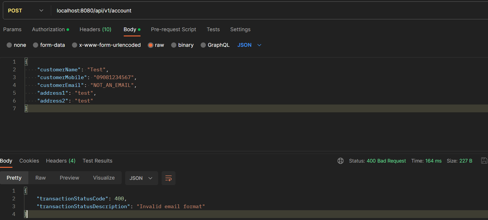
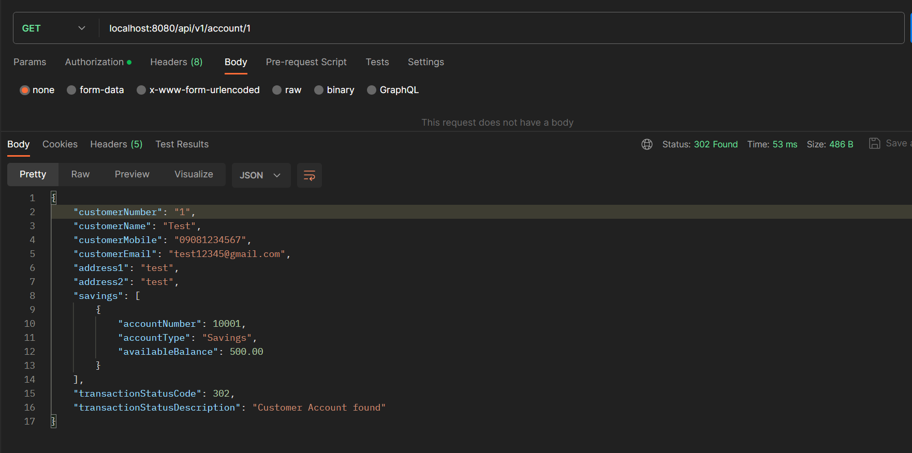
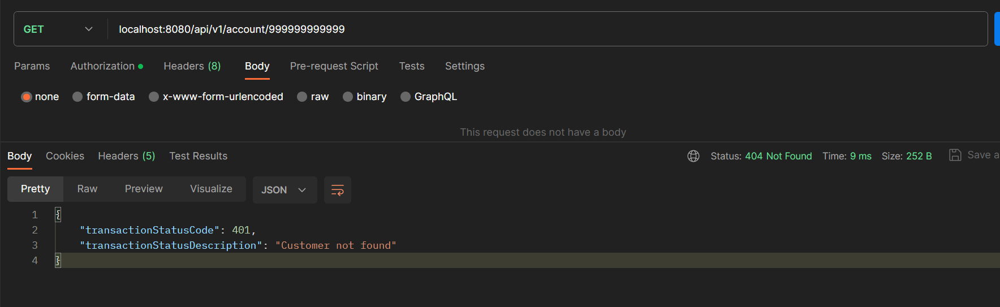

# TECHNICAL ASSESMENT FROM : **`Rising Tide Digital`**

1. Test Case 1: Success ✔️
  - Endpoint:
    - `/POST localhost:8080/api/v1/account`
  - Sample Payload
    - ```json
      {
          "customerName": "Test",
          "customerMobile": "09081234567",
          "customerEmail": "test12345@gmail.com",
          "address1": "test",
          "address2": "test"
      }
      ```
  - Sample result
    - ```json
      {
          "customerNumber": 2,
          "transactionStatusCode": 201,
          "transactionStatusDescription": "Customer Account Created"
      }
      ```
  - snapshot
    - 

2. Test Case 2: Fail ❌
  - Endpoint: 
    - `/POST localhost:8080/api/v1/account`
  - Sample Payload:
    - ```json
      {
          "customerName": "Test",
          "customerMobile": "09081234567",
          "customerEmail": "NOT_AN_EMAIL",
          "address1": "test",
          "address2": "test"
      }
      ```
  - Sample result:
    - ```json
      {
          "transactionStatusCode": 400,
          "transactionStatusDescription": "Invalid email format"
      }
      ```
  - snapshot
    - 

3. Test Case 3: Success ✔️
  - Endpoint:
    - `/GET localhost:8080/api/v1/account/1`
  - Sample result
    - ```json
      {
          "customerNumber": "1",
          "customerName": "Test",
          "customerMobile": "09081234567",
          "customerEmail": "test12345@gmail.com",
          "address1": "test",
          "address2": "test",
          "savings": [
              {
                  "accountNumber": 10001,
                  "accountType": "Savings",
                  "availableBalance": 500.00
              }
          ],
          "transactionStatusCode": 302,
          "transactionStatusDescription": "Customer Account found"
      }
      ```
  - snapshot
    - 

4. Test Case 3: Failed ❌
  - Endpoint:
    - `/GET localhost:8080/api/v1/account/999999999999`
  - Sample result
    - ```json
      {
          "transactionStatusCode": 401,
          "transactionStatusDescription": "Customer not found"
      }
      ```
  - snapshot
    - 